# Linux
 ## Linux is an open-source operating system (OS) used to run servers, computers, mobile devices, cloud platforms, networking systems, and even supercomputers.

  ## It is known for being fast, secure, stable, and free. 

## 🐧 What is Linux?

Linux is an operating system just like:

> Windows

 > macOS

> Android

But Linux is open-source, meaning its source code is free and can be modified by anyone

 ## ⭐ Why DevOps Engineers Prefer Linux

 > Free and open-source

 > Extremely stable

 > Very secure

 > Easy automation (shell scripts, cron, systemd)

 > Works perfectly with cloud tools

 > Excellent for performance monitoring & troubleshooting

 ## **🐧 Linux – Real-Time Use Case: Server Setup & Automation **

# **  ⭐ Level 1 – Basic (Foundational Skills) **

 ###  ✅ Set up users, groups for dev team
 ````bash
sudo groupadd devteam
sudo useradd -m -s /bin/bash alice
sudo useradd -m -s /bin/bash bob
sudo usermod -aG devteam alice
sudo usermod -aG devteam bob
````
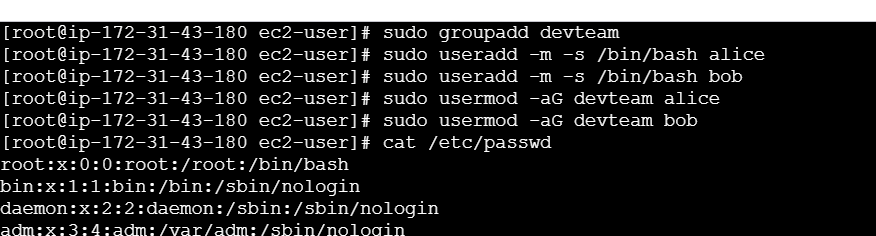


### Set passwords
````bash
sudo passwd alice
sudo passwd bob
````
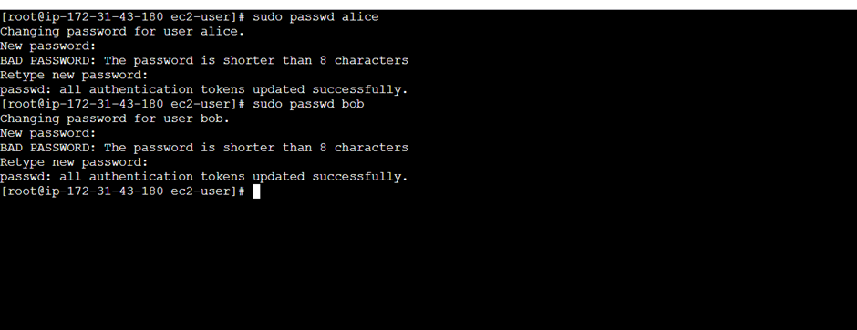


## ✅  Manage permissions for project directories ##
````bash
sudo mkdir -p /opt/app
sudo chown :devteam /opt/app
sudo chmod 770 /opt/app
````
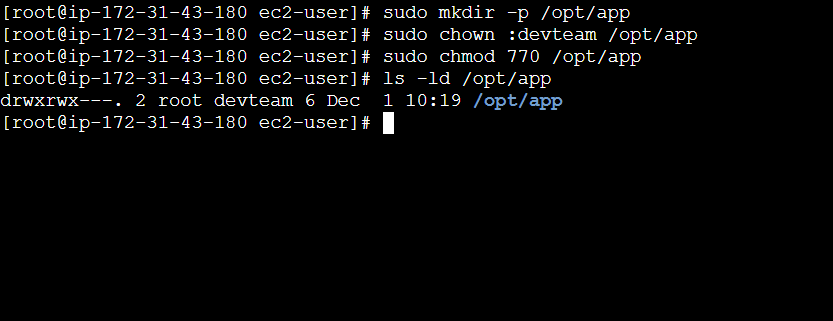

 ###  ✅ Install required packages (git, nginx, java)
 ````bash
 sudo yum  update -y
 sudo yum  install -y git
 sudo yum  install -y nginx
 sudo yum  install -y java*
````
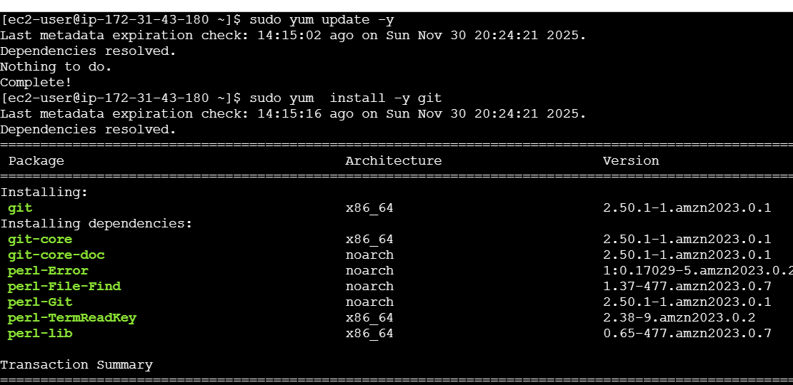
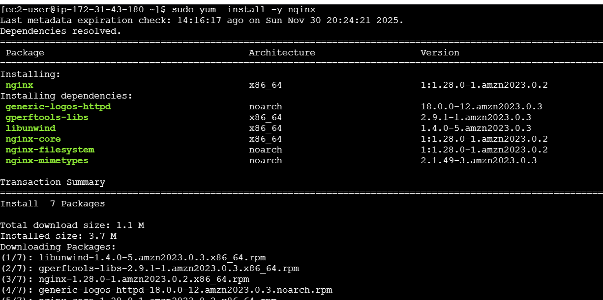
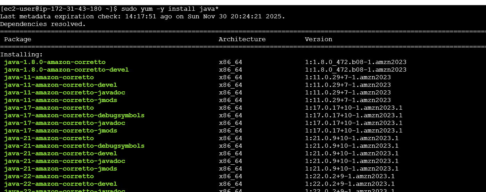
###  ✅ start & enable service
```bash
sudo systemctl start  nginx
sudo systemctl enable nginx
sudo systemctl status nginx
```
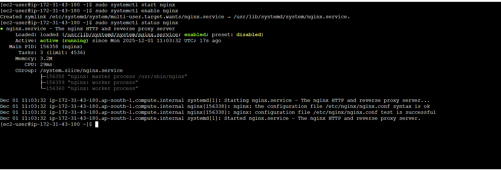
### ✅  Check system info (memory, CPU, disks)
````bash
free -h         # RAM
lscpu           # CPU
df -h           # Disk usage
lsblk           # Block devices
````
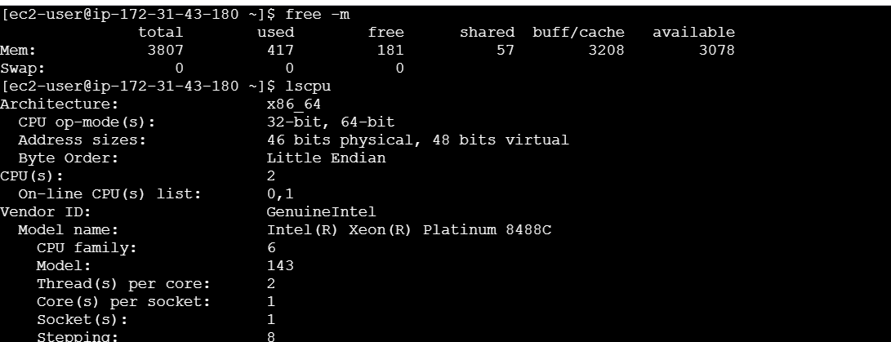
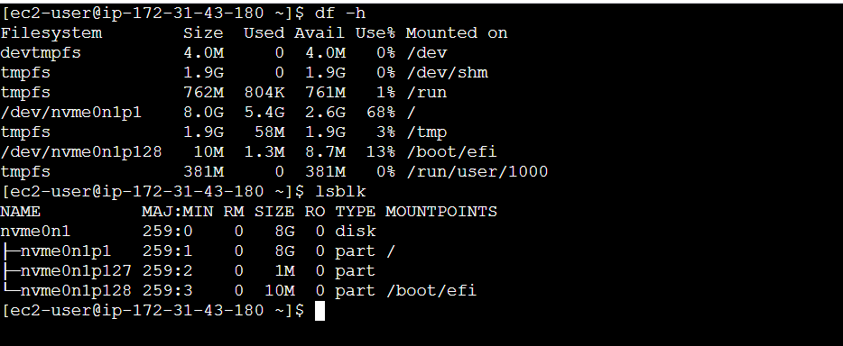
# ** ⭐ Level 2 – Intermediate (Daily DevOps Tasks) **

 ###  ✅ Automate backups with Cron
 ### Backup /opt/app every day at 2 AM
 ### Create a script
 ````bash
 sudo vi /usr/local/bin/backup_app.sh
 ````
 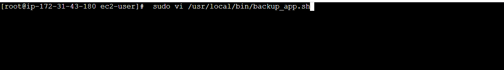
 ### paste the script
 ````bash
#!/bin/bash


# Create /backup if it doesn't exist
mkdir -p /backup

# Create backup file with today’s date
tar -czf /backup/app-$(date +%F).tar.gz /opt/app

# Delete backups older than 7 days
find /backup -type f -mtime +7 -delete

````
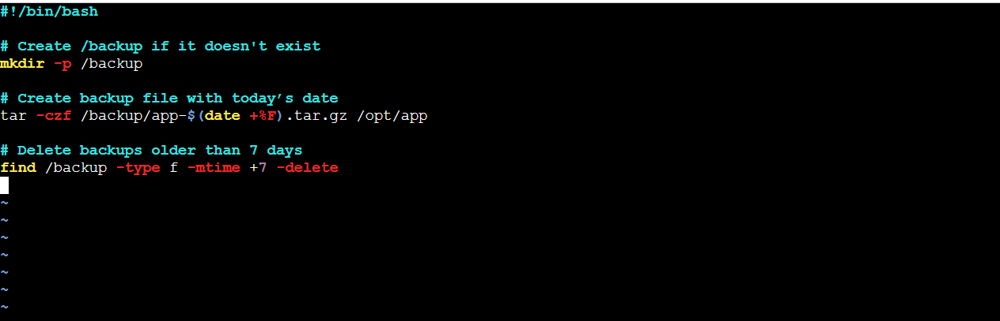
### Make it executable
````bash
sudo chmod +x /usr/local/bin/backup_app.sh
````
### Add cron job
 ````bash
 crontab -e
````
##
 Add:
````bash
0 2 * * * /usr/local/bin/backup_app.sh

````


##  Create shell scripts: Log cleanup, service restart, health checks
###  ✅ a) Log cleanup
````bash
#!/bin/bash
find /var/log/app/ -type f -mtime +7 -exec rm -f {} \;
````
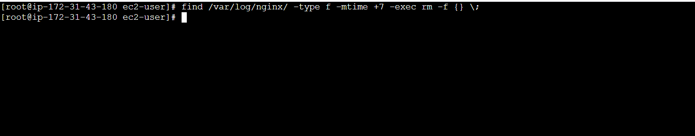
###  ✅ b) service restart
``` bash
#!/bin/bash
systemctl restart nginx
systemctl status nginx
```
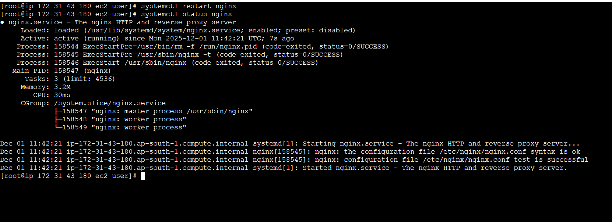
### ✅  c) Health checks
```bash
#!/bin/bash
curl -I http://localhost:80 
```
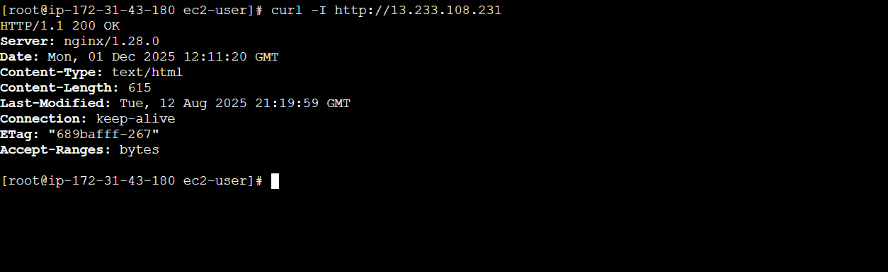

### ✅ Manage logs under /var/log
````bash
tail -f /var/log/nginx/access.log
tail -f /var/log/nginx/error.log
journalctl -u nginx
du -sh /var/log/*
````
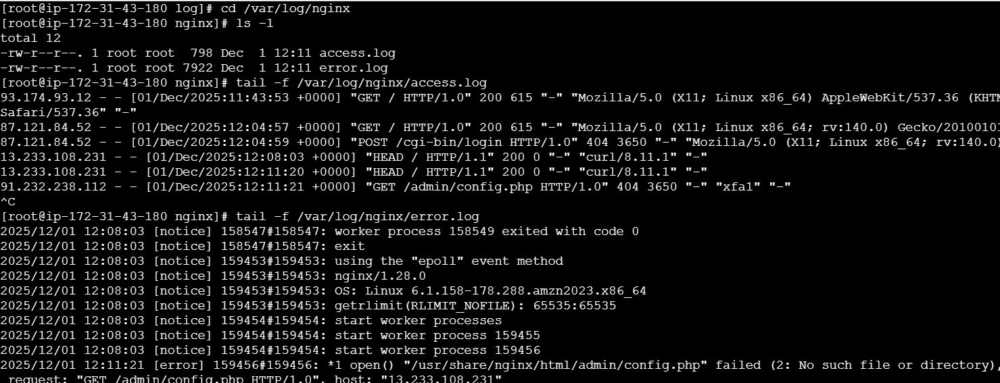
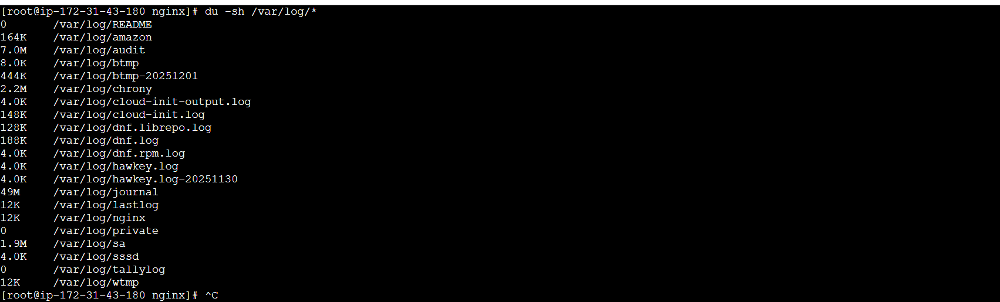


### ✅  Monitor System Performance
````bash
top
htop
iostat
vmstat 5
````
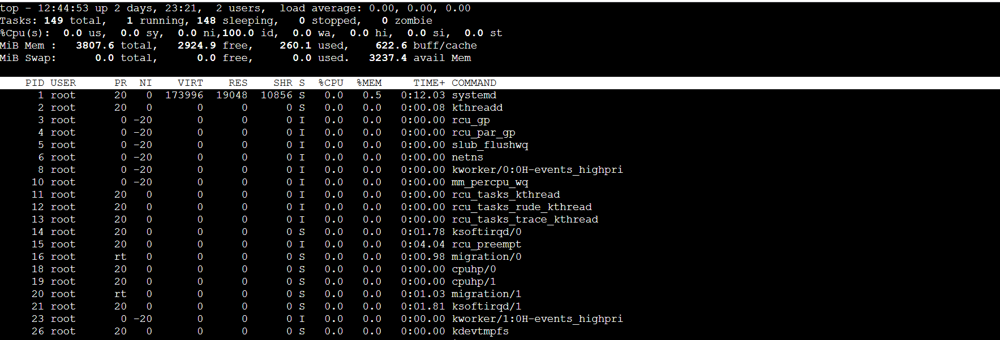
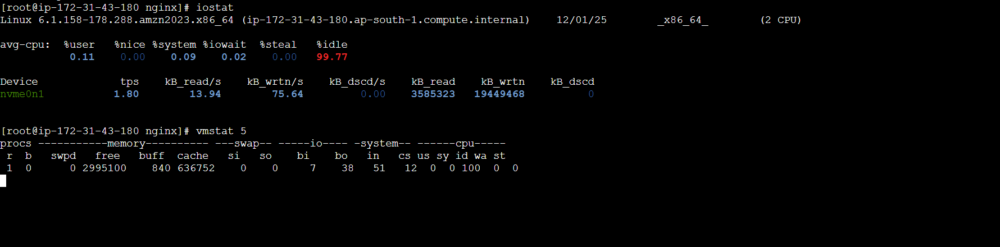
##  ✅ Troubleshoot services
###  1. Check service status
This tells you if a service is running, stopped, or failed.
````bash
systemctl status nginx
````
Look for:

- active (running) → OK

- inactive (dead) → not running

- failed → something broke

### ✅ 2. Start or restart the service
````bash
sudo systemctl start nginx
sudo systemctl restart nginx
````
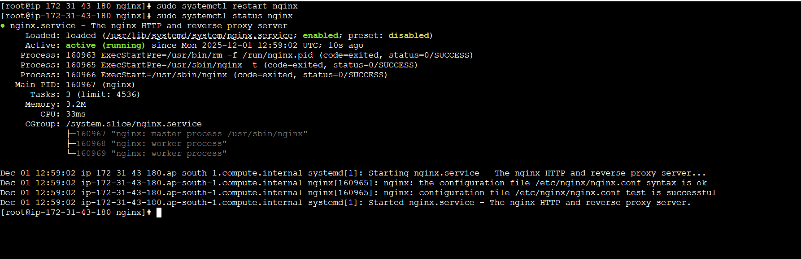
### ✅ 3. Check service logs (journalctl)
````bash
sudo journalctl -u nginx -f
````
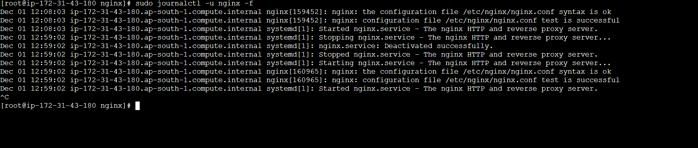
# ** ⭐ Level 3 – Advanced (Production-Ready Linux Admin) **
### ✅ 1. Create Custom systemd Service
File: /etc/systemd/system/myapp.service
````bash
[Unit]
Description=My Application
After=network.target

[Service]
User=dev1
WorkingDirectory=/opt/myapp
ExecStart=/usr/bin/java -jar app.jar
Restart=always

[Install]
WantedBy=multi-user.target
````
## Enable & start:
```bash
sudo systemctl daemon-reload
sudo systemctl enable nginx
sudo systemctl start nginx
````
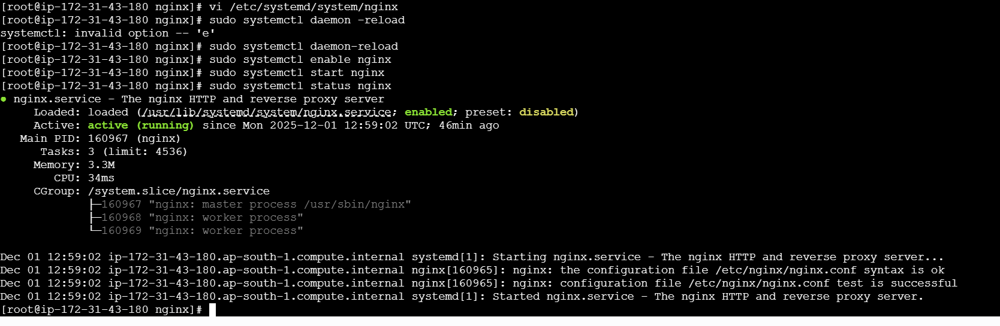
### ✅ 2. SSH Hardening
### Edit
````bash
sudo vi  /etc/ssh/sshd_config
````
### Apply
````bash
PermitRootLogin no
PasswordAuthentication no
AllowUsers alice bob 
````
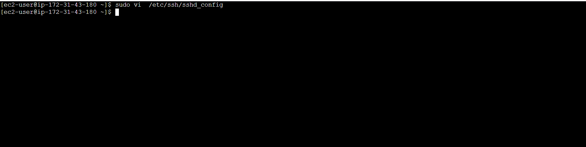
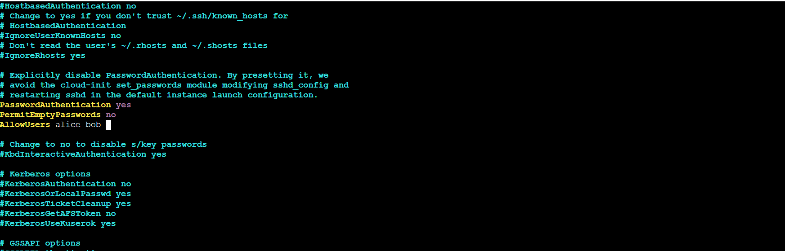

### Restart SSH:
````bash
sudo systemctl restart sshd
````
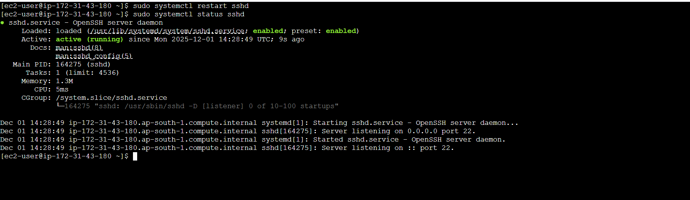
## ✅ 3. LVM Setup for Storage Scaling
### Install LVM tools
````bash
sudo yum install -y lvm2
````
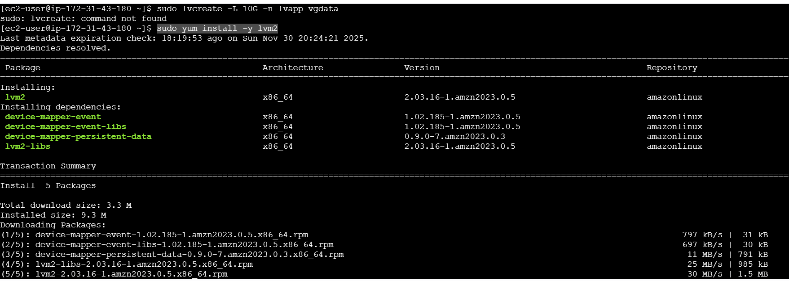

To create an LV, first you must create:

## 1️⃣ physical volume (PV)
## 2️⃣ volume group (VG)
## 3️⃣ Logical volume (LV)


### ✅ STEP 1 — Identify your disk**

Run:

```bash
lsblk
```
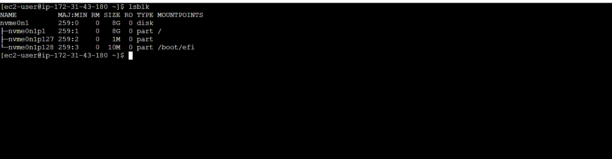
````bash
nvme0n1        8G   (main disk)
├─nvme0n1p1    8G   mounted on /
├─nvme0n1p127  1M
└─nvme0n1p128 10M   mounted on /boot/efi
````
✅ If you want to learn or practice LVM → You must add a new disk
🚀 Next Steps (Do This)
STEP 1: Add a New Disk in AWS

Go to:
EC2 → Instances → Select instance →
Actions → Storage → Attach EBS volume

Create a new volume:

Size: 5GB / 10GB

Type: gp3

Availability Zone: Same as instance

Attach → it will appear as:
````bash
/dev/nvme1n1
````
Look for a free disk like `/dev/nvme1n1`.

---

## ✅ STEP 2 — Create Physical Volume

Assume your free disk is `/dev/nvme1n1`
(If your disk is different, replace it!)

```bash
sudo pvcreate /dev/nvme1n1
```

---

## ✅ STEP 3 — Create Volume Group

```bash
sudo vgcreate vgdata /dev/nvme1n1
```

Now check:

```bash
vgs
```

You should see `vgdata`.

---

## ✅ STEP 4 — Create Logical Volume

Now your earlier command will work:

```bash
sudo lvcreate -L 10G -n lvapp vgdata
```

---

## ✅ STEP 5 — Format the LV

```bash
sudo mkfs.ext4 /dev/vgdata/lvapp
```

---

## ✅ STEP 6 — Mount it

```bash
sudo mkdir /mnt/appdata
sudo mount /dev/vgdata/lvapp /mnt/appdata
````


## ✅ Install and Enable Firewalld on Amazon Linux 2023

Run these commands:

### 1. Install firewalld

```bash
sudo dnf install firewalld -y
```
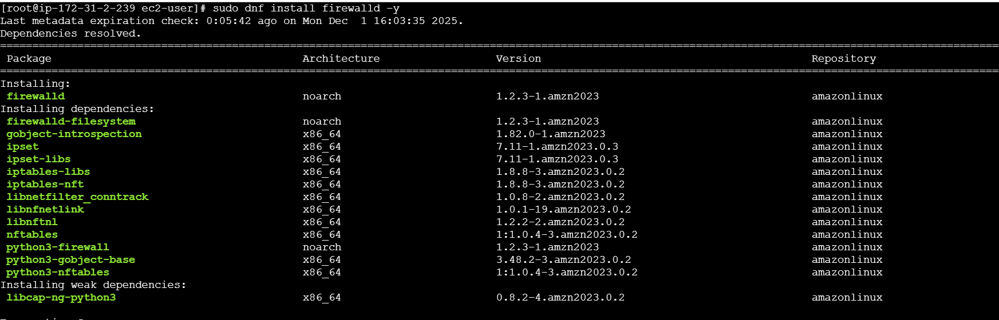

## 2. Enable firewalld to start at boot

```bash
sudo systemctl enable firewalld
```

## 3. Start firewalld

```bash
sudo systemctl start firewalld
```

## 4. Check the status

```bash
sudo systemctl status firewalld
```
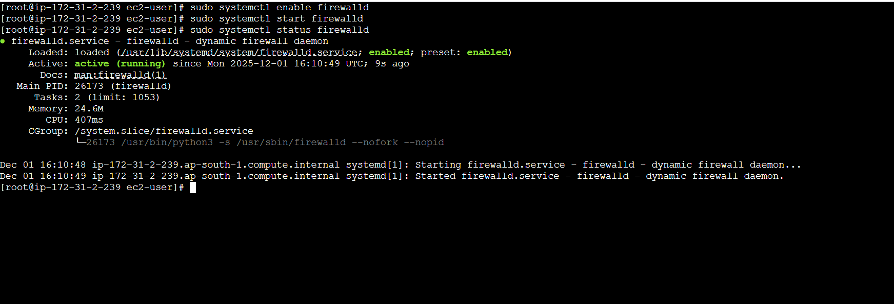

Here is a **perfect logrotate configuration for Nginx**, including rotation, compression, permissions, and automatic Nginx reload.

---

## ✅ Nginx Logrotate Configuration (Recommended)

Create or edit the config file:

```bash
sudo vi  /etc/logrotate.d/nginx
```

Paste this full configuration:

```bash
/var/log/nginx/*.log {
    daily                  # rotate logs daily
    missingok              # ignore if log file is missing
    rotate 14              # keep 14 days of logs
    compress               # compress rotated logs (.gz)
    delaycompress          # compress on next cycle
    notifempty             # skip rotating empty logs
    sharedscripts

    postrotate
        # Only reload nginx if it is running
        if pidof nginx > /dev/null; then
            systemctl reload nginx > /dev/null 2>&1;
        fi
    endscript
}
```

---

##  What this config does

| Setting         | Meaning                                                    |
| --------------- | ---------------------------------------------------------- |
| `daily`         | Rotate logs every day                                      |
| `rotate 14`     | Keep logs for 14 days                                      |
| `compress`      | Old logs become `.gz` (saves disk space)                   |
| `delaycompress` | Compress next day (keeps 1 day uncompressed for debugging) |
| `notifempty`    | Skip empty logs                                            |
| `missingok`     | No error if log not found                                  |
| `sharedscripts` | Run postrotate only once                                   |
| `postrotate`    | Reload Nginx so it reopens fresh log files                 |

---

## 🔧 Test the config

## 1. Debug mode (no rotation, safe test) ##

```bash
sudo logrotate -dv /etc/logrotate.d/nginx
```

## 2. Force rotate now (for checking)

```bash
sudo logrotate -fv /etc/logrotate.d/nginx
```

Your logs will become:

``` bash 
access.log
access.log-20251201.gz
error.log
error.log-20251201.
````
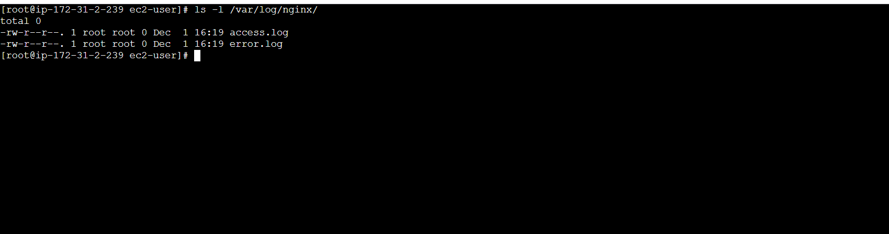


